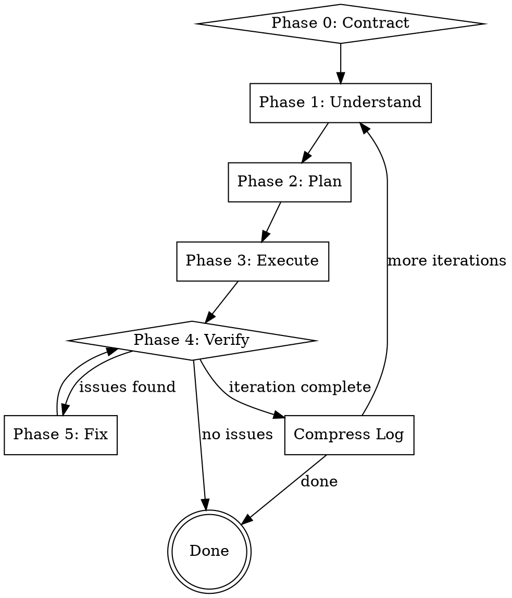

# E-Build Skill Implementation Plan

> **For Claude:** REQUIRED SUB-SKILL: Use superpowers:executing-plans to implement this plan task-by-task.

**Goal:** Create a `/e-build` skill for Claude Code that autonomously executes full engineering tasks with a self-driving understand→plan→execute→verify→iterate loop, full process logging, and minimal human intervention.

**Architecture:** Single SKILL.md with supporting prompt files for each subagent phase. State persistence via file system (`.agent-log/` directory) rather than conversation context. Subagents are dispatched per phase for context isolation. The master skill orchestrates the flow, reads/writes state files, and manages iteration loops.

**Tech Stack:** Claude Code skills (SKILL.md format), subagent orchestration via Agent tool, file-based state, Markdown logging.

---

### Task 1: Create skill directory and SKILL.md frontmatter

**Files:**
- Create: `~/.claude/skills/e-build/SKILL.md`

**Step 1: Create the directory**

```bash
mkdir -p ~/.claude/skills/e-build
```

**Step 2: Write the SKILL.md frontmatter and overview**

Write `~/.claude/skills/e-build/SKILL.md` with:
- YAML frontmatter: `name: e-build`, description focused on triggering conditions (NOT workflow summary), under 500 chars
- Brief overview section
- Invocation syntax

Frontmatter:
```yaml
---
name: e-build
description: Use when starting a greenfield implementation, replicating an existing project, refactoring a module, or improving an existing codebase. Triggers on "build", "implement", "create project", "replicate", "engineer", or any task requiring multi-step code execution with verification.
---
```

**Step 3: Verify frontmatter**

Run: `head -5 ~/.claude/skills/e-build/SKILL.md`
Expected: YAML frontmatter with `name: e-build` and description starting with "Use when..."

---

### Task 2: Create the subagent prompt templates

The e-build skill dispatches subagents for each phase. Each phase has its own prompt template file. Create all of them.

**Files:**
- Create: `~/.claude/skills/e-build/prompts/understand.md`
- Create: `~/.claude/skills/e-build/prompts/plan.md`
- Create: `~/.claude/skills/e-build/prompts/execute-step.md`
- Create: `~/.claude/skills/e-build/prompts/verify.md`
- Create: `~/.claude/skills/e-build/prompts/fix.md`
- Create: `~/.claude/skills/e-build/prompts/compress-log.md`

**Step 1: Create prompts directory**

```bash
mkdir -p ~/.claude/skills/e-build/prompts
```

**Step 2: Write understand.md**

Content for `~/.claude/skills/e-build/prompts/understand.md`:

```markdown
You are a deep understanding agent for the /e-build skill.

Your job: Read and analyze the task description and all reference materials, then produce a comprehensive understanding document.

INPUTS:
- Task description: {task_description}
- State directory: {state_dir}
- Reference materials: {references}

INSTRUCTIONS:

1. Read the task description from the state file: {state_dir}/session.md (Goal section)
2. Read ALL reference materials listed above
3. Analyze thoroughly — be paranoid about missing requirements

For IMPLEMENTATION tasks (replicating/creating something):
- Read and analyze all source materials (design docs, reference code, screenshots)
- Identify ALL functional requirements, not just obvious ones
- Map out interaction flows, especially non-obvious ones (JS-driven state changes, long interaction chains)
- Document edge cases, hidden behaviors, and non-obvious state transitions
- For UI tasks: document every interactive element, its trigger, its expected behavior, and its visual state

For IMPROVEMENT tasks (refactoring, bug fixing, enhancing):
- Analyze current codebase structure
- Identify what exists, what needs to change, what constraints exist
- Understand dependencies and impact radius
- Document current behavior that must be preserved

OUTPUT:
Write your analysis to {state_dir}/understanding.md in this format:

```markdown
# Understanding

## Task Type
[implementation | improvement]

## Requirements
[List every requirement found, numbered]

## Interaction Flows
[For each flow: trigger → steps → expected outcome]

## Edge Cases
[Known edge cases and how they should be handled]

## Constraints
[Technical constraints, must-haves, must-not-haves]

## Source Analysis
[Summary of what was found in reference materials]

## Open Questions
[Anything ambiguous that needs resolution — if empty, say "None"]
```

CRITICAL: Missing a requirement here costs many iterations later. Be thorough.
```

**Step 3: Write plan.md**

Content for `~/.claude/skills/e-build/prompts/plan.md`:

```markdown
You are a planning agent for the /e-build skill.

Your job: Read the understanding document and create an atomic, ordered execution plan.

INPUTS:
- State directory: {state_dir}

INSTRUCTIONS:

1. Read {state_dir}/understanding.md
2. Break the work into atomic, independently executable steps
3. Order steps by dependencies
4. Each step should be small enough to complete in one subagent session

OUTPUT:
Write your plan to {state_dir}/plan.md in this format:

```markdown
# Execution Plan

## Steps

### Step 1: [title]
- **Objective**: What this step accomplishes
- **Files**: Expected files to create/modify
- **Dependencies**: None (or list of step numbers)
- **Verification**: How to verify this step succeeded
- **Risk**: low | medium | high

### Step 2: [title]
...
```

RULES:
- Steps must be atomic — one clear deliverable per step
- Steps must be ordered — dependencies come first
- Each step must have a clear verification criterion
- Group related changes into single steps — don't fragment unnecessarily
- Keep step count reasonable: 3-15 steps for most tasks
```

**Step 4: Write execute-step.md**

Content for `~/.claude/skills/e-build/prompts/execute-step.md`:

```markdown
You are an execution agent for the /e-build skill.

Your job: Execute ONE step of the execution plan by writing/modifying code.

INPUTS:
- State directory: {state_dir}
- Step number: {step_number}

INSTRUCTIONS:

1. Read {state_dir}/plan.md to understand the full plan context
2. Read {state_dir}/understanding.md for requirement details
3. Execute step {step_number} specifically
4. Write code, create files, modify existing files as needed
5. After completing, log what you did

OUTPUT:
After completing your work, append a log entry to {state_dir}/session.md:

```
### Step {step_number}: [title]
`{timestamp}` — {summary of what was done, files changed, any deviations from plan}
```

RULES:
- Execute ONLY the assigned step — do not do other steps
- If you encounter ambiguity, make the best judgment call and note it in the log
- If you cannot complete the step, log the failure and what was attempted
- Write clean, production-quality code
```

**Step 5: Write verify.md**

Content for `~/.claude/skills/e-build/prompts/verify.md`:

```markdown
You are a verification agent for the /e-build skill.

Your job: Verify the implementation against requirements using the chosen verification methods.

INPUTS:
- State directory: {state_dir}
- Verification methods: {verification_methods}

INSTRUCTIONS:

1. Read {state_dir}/session.md (Goal and Verification Plan sections)
2. Read {state_dir}/understanding.md for detailed requirements
3. Read {state_dir}/plan.md for what was supposed to be built

For each verification method in {verification_methods}:

**design-comparison**:
- Read the design document (referenced in session.md)
- Compare implemented features against specified requirements
- List: implemented correctly, implemented incorrectly, missing entirely
- For each issue, quote the specific requirement and what the implementation does instead

**automated-testing**:
- Run existing tests: `npm test` / `pytest` / `go test` / etc. (auto-detect framework)
- If tests fail, analyze failures and categorize: assertion failure, runtime error, missing test
- Report pass/fail per test suite with failure analysis

**visual-comparison** (frontend only):
- Start the application (detect how: npm run dev, python manage.py runserver, etc.)
- Capture screenshots of key pages/states using the browser
- Compare against reference screenshots if available, or describe what you see
- Report visual differences

**code-review**:
- Analyze code quality, redundancy, consistency with understanding.md
- Check for dead code, unused imports, architectural violations
- Report issues by severity: critical, major, minor

OUTPUT:
Write your report to {state_dir}/verify-report.md in this format:

```markdown
# Verification Report

## Method: [method name]
**Status**: PASS | FAIL | PARTIAL

### Issues Found
1. **[severity]** [issue description]
   - Expected: [what should be]
   - Actual: [what is]
   - File: [file path]
   - Fix suggestion: [brief suggestion]

### Summary
[Overall assessment]
```

If multiple methods are specified, include a section for each.

CRITICAL: Be thorough. Every issue you catch saves an iteration. Every issue you miss requires human intervention.
```

**Step 6: Write fix.md**

Content for `~/.claude/skills/e-build/prompts/fix.md`:

```markdown
You are a fix agent for the /e-build skill.

Your job: Read the verification report and fix all identified issues.

INPUTS:
- State directory: {state_dir}
- Iteration number: {iteration_number}

INSTRUCTIONS:

1. Read {state_dir}/verify-report.md — this is your task list
2. Read {state_dir}/understanding.md for requirement context
3. Prioritize fixes: critical → major → minor
4. Fix each issue one by one
5. After fixing all issues, log what was done

OUTPUT:
- Fix the issues in the codebase
- Create/update {state_dir}/iteration-{iteration_number}/changes.md with a summary of all fixes
- Append a log entry to {state_dir}/session.md:

```
### Phase 5: Fix (iteration {iteration_number})
`{timestamp}` — Fixed {N} issues: {brief summary of fixes}
```

RULES:
- Fix ALL issues in the report, not just some
- If you're unsure about a fix, make your best attempt and note the uncertainty
- Do not introduce new features — only fix what the report identifies
- If a fix requires changes to multiple files, make all related changes
```

**Step 7: Write compress-log.md**

Content for `~/.claude/skills/e-build/prompts/compress-log.md`:

```markdown
You are a log compression agent for the /e-build skill.

Your job: Compress an overly long session.md log while preserving essential information.

INPUTS:
- State directory: {state_dir}

INSTRUCTIONS:

1. Read {state_dir}/session.md
2. Keep the Goal and Verification Plan sections EXACTLY as they are
3. Keep the Progress Summary section (update it with a comprehensive summary of ALL iterations)
4. Keep ONLY the current iteration in detail
5. Compress all previous iterations into the Progress Summary
6. Write the compressed version back to {state_dir}/session.md

OUTPUT FORMAT (compressed session.md):

```markdown
# Build: [task summary]

## Goal
[UNCHANGED from original]

## Verification Plan
[UNCHANGED from original]

## Progress Summary
[Comprehensive summary of ALL work done across all iterations.
Include: what was built, what issues were found, what was fixed, current status.
This should be a readable narrative, not a list.]

## Iteration [current]
[Full detail of only the current iteration]
```

RULES:
- Goal and Verification Plan must be byte-for-byte identical
- Progress Summary should be informative enough for a human to understand the full history
- Current iteration keeps full detail
- Target: under 200 lines total
```

**Step 8: Verify all prompt files exist**

```bash
ls -la ~/.claude/skills/e-build/prompts/
```
Expected: 6 files (understand.md, plan.md, execute-step.md, verify.md, fix.md, compress-log.md)

---

### Task 3: Write the main SKILL.md body

**Files:**
- Modify: `~/.claude/skills/e-build/SKILL.md`

**Step 1: Write the complete SKILL.md**

Write the full content to `~/.claude/skills/e-build/SKILL.md`. This is the orchestration document that tells Claude how to execute the build loop.

The skill should contain these sections:

1. **Overview** — one sentence
2. **Invocation** — syntax with parameters
3. **Architecture** — file-based state, subagent isolation
4. **Execution Flow** — the main phase loop with a flowchart
5. **Phase 0: Contract** — human gate, verification selection
6. **Phase 1-5** — each phase with subagent dispatch instructions
7. **Iteration Loop** — how to handle --iterations N and log compression
8. **Context Management** — preset strategies (subagent sizing, failure recovery)
9. **Common Mistakes** — what goes wrong and how to prevent it

Key design decisions baked into the skill:
- All subagent prompts reference `{state_dir}` for file-based state passing
- The master agent reads prompt templates from `./prompts/*.md` and fills in variables before dispatching
- Log compression triggers at 200 lines
- Failure recovery: retry once, then skip with warning
- Convergence: if verify-report shows zero issues, stop. Otherwise iterate until max.

Full content:

```markdown
---
name: e-build
description: Use when starting a greenfield implementation, replicating an existing project, refactoring a module, or improving an existing codebase. Triggers on "build", "implement", "create project", "replicate", "engineer", or any task requiring multi-step code execution with verification.
---

# /e-build

Self-driving execution loop: understand → plan → execute → verify → iterate. File-based state, subagent isolation, full process logging. Human only interacts at Phase 0.

## Invocation

```
/e-build "<task description>" [--iterations N] [--verification "method1,method2"]
```

- `<task description>`: What to build/improve. Can include file paths, URLs, or references.
- `--iterations N`: Full closed-loop cycles (default 1). Each iteration resets the subagent chain.
- `--verification`: Comma-separated methods (design-comparison, automated-testing, visual-comparison, code-review). If omitted, auto-detect and ask human.

## Architecture

All state in files. Never in conversation context.

```
.agent-log/<timestamp>-e-build/
  session.md          # Master log: head=goal, tail=progress
  understanding.md    # Phase 1 output
  plan.md             # Phase 2 output
  verify-report.md    # Phase 4 output
  iteration-N/        # Per-iteration details
    changes.md
    verify-report.md
```

Subagents are isolated — fresh context per phase. State passes through files, not conversation.

## Execution Flow



## Phase 0: Contract Confirmation (Human Gate)

**This is the ONLY phase requiring human interaction.**

1. Parse invocation arguments: extract task description, iterations count, verification methods.
2. Create state directory: `.agent-log/<YYYY-MM-DD-HHMMSS>-e-build/`
3. Initialize `session.md` with Goal section (the task description).
4. If `--verification` was provided, use those methods. Otherwise:
   - Analyze the project to determine available verification methods.
   - Ask human to select which verification methods to use via AskUserQuestion.
   - Available methods: `design-comparison`, `automated-testing`, `visual-comparison`, `code-review`.
5. Write the Verification Plan to session.md.
6. Proceed to Phase 1.

## Phase 1: Deep Understanding

Dispatch a subagent:

```
Agent({
  subagent_type: "general-purpose",
  description: "Deep understanding analysis",
  prompt: <contents of ./prompts/understand.md with {variables} filled>
})
```

Variables to fill: `{task_description}`, `{state_dir}`, `{references}` (any file paths or URLs from the task description).

After the subagent completes, verify `understanding.md` exists in state_dir. If it has "Open Questions" with entries, attempt to resolve them from the task context. If unresolvable, log a warning and proceed.

Append Phase 1 log entry to session.md.

## Phase 2: Planning

Dispatch a subagent:

```
Agent({
  subagent_type: "Plan",
  description: "Create execution plan",
  prompt: <contents of ./prompts/plan.md with {variables} filled>
})
```

Variables: `{state_dir}`.

After completion, read `plan.md` and verify:
- Steps are ordered
- Each step has a verification criterion
- Dependencies are consistent

Append Phase 2 log entry to session.md.

## Phase 3: Execution

For each step in plan.md:

1. Dispatch a subagent:

```
Agent({
  subagent_type: "general-purpose",
  description: "Execute step N",
  prompt: <contents of ./prompts/execute-step.md with {variables} filled>
})
```

Variables: `{state_dir}`, `{step_number}`.

2. If the subagent fails (error, timeout), retry once. If retry fails, log the failure with `**FAILED**` marker and continue to next step.

3. After each step, read the session.md tail to confirm the log entry was written.

**For long plans (>8 steps):** Consider parallelizing independent steps using multiple Agent calls in a single message. Check step dependencies first.

Append Phase 3 log entry to session.md.

## Phase 4: Verification

Dispatch a subagent:

```
Agent({
  subagent_type: "general-purpose",
  description: "Verify implementation",
  prompt: <contents of ./prompts/verify.md with {variables} filled>
})
```

Variables: `{state_dir}`, `{verification_methods}`.

After completion, read `verify-report.md`:

- If Status is **PASS** for all methods → proceed to Done.
- If Status is **FAIL** or **PARTIAL** → proceed to Phase 5.

Append Phase 4 log entry to session.md.

## Phase 5: Iteration Fix

If verification found issues:

1. Create `iteration-N/` directory in state_dir.
2. Copy verify-report.md to `iteration-N/verify-report.md`.
3. Dispatch a subagent:

```
Agent({
  subagent_type: "general-purpose",
  description: "Fix verification issues",
  prompt: <contents of ./prompts/fix.md with {variables} filled>
})
```

Variables: `{state_dir}`, `{iteration_number}`.

4. After fixes, go back to Phase 4 (re-verify).

Append Phase 5 log entry to session.md.

## Iteration Loop

**Convergence detection:**
- After Phase 4, if verify-report shows zero new issues (compared to previous iteration) → declare success.
- If issues persist but count is decreasing → continue iterating.
- If issues count stays the same across 2 iterations → log a warning, continue with remaining iterations.
- If max iterations reached → stop and report remaining issues.

**Multi-iteration (--iterations N > 1):**
After completing one full cycle (Phases 1-5):
1. Count lines in session.md. If >200, dispatch compress-log subagent.
2. If more iterations remaining, start fresh Phase 1 (subagent reads session.md for context).

**Single iteration (default):**
Execute Phases 1-5 once. Stop after convergence or first full cycle.

## Context Management

### Subagent Sizing
- Understanding: `general-purpose` (reads lots of files)
- Planning: `Plan` (structured output)
- Execution: `general-purpose` per step
- Verification: `general-purpose`
- Fix: `general-purpose`

### Failure Recovery
- Subagent fails → retry once with fresh subagent → if fails again, log `**FAILED**` and continue
- Never block entire execution on one step failure

### Log Compaction
- When session.md exceeds 200 lines → dispatch compress-log subagent
- Goal and Verification Plan: unchanged
- Older iterations: compressed into Progress Summary
- Current iteration: kept in detail

## Completion

When done, print a summary to the human:

```
Build complete.
  Iterations: N
  Issues remaining: M (if any)
  Log: .agent-log/<timestamp>-e-build/session.md
  Full details: head -20 .agent-log/<timestamp>-e-build/session.md
```

If issues remain, tell the human which issues and suggest next steps.

## Common Mistakes

| Mistake | Fix |
|---------|-----|
| Passing state through conversation instead of files | Always use {state_dir} files for inter-phase state |
| Skipping Phase 1 "to save time" | Understanding prevents cascading errors. Never skip. |
| Not logging failures | Log everything, including failures with **FAILED** marker |
| Running verification only once | Always re-verify after fixes |
| Letting context grow too long | Dispatch subagents frequently, compress log when >200 lines |
```

**Step 2: Verify the SKILL.md is valid**

```bash
wc -w ~/.claude/skills/e-build/SKILL.md && head -6 ~/.claude/skills/e-build/SKILL.md
```
Expected: Word count under 500 for frequently-loaded sections, valid YAML frontmatter.

---

### Task 4: Smoke test — verify skill is discoverable

**Files:**
- None (verification only)

**Step 1: Verify directory structure**

```bash
find ~/.claude/skills/e-build -type f | sort
```

Expected:
```
~/.claude/skills/e-build/SKILL.md
~/.claude/skills/e-build/prompts/compress-log.md
~/.claude/skills/e-build/prompts/execute-step.md
~/.claude/skills/e-build/prompts/fix.md
~/.claude/skills/e-build/prompts/plan.md
~/.claude/skills/e-build/prompts/understand.md
~/.claude/skills/e-build/prompts/verify.md
```

**Step 2: Verify frontmatter parses correctly**

```bash
head -3 ~/.claude/skills/e-build/SKILL.md
```

Expected: Valid YAML with `name: e-build` and `description:` starting with "Use when..."

**Step 3: Test skill invocation recognition**

Start a new Claude Code session and type `/e-build`. Verify the skill appears in the available skills list and its SKILL.md content is loaded.

---

### Task 5: Integration test — run e-build on a trivial task

**Files:**
- None (runtime test)

**Step 1: Create a minimal test scenario**

Create a temporary test directory:

```bash
mkdir -p /tmp/e-build-skill-test && cd /tmp/e-build-skill-test
git init
```

**Step 2: Run /e-build on a trivial task**

```
/e-build "Create a simple Python CLI tool called 'greet' that takes a name as argument and prints 'Hello, {name}!' Support --iterations 1 --verification code-review,automated-testing
```

**Step 3: Verify outputs**

Check that `.agent-log/` was created with the expected structure:

```bash
find .agent-log -type f | sort
```

Expected: `session.md`, `understanding.md`, `plan.md`, `verify-report.md` at minimum.

**Step 4: Verify session.md quality**

```bash
head -30 .agent-log/*/session.md
```

Expected: Clear Goal section, Verification Plan section, and Phase entries with timestamps.

**Step 5: Clean up**

```bash
rm -rf /tmp/e-build-skill-test
```
