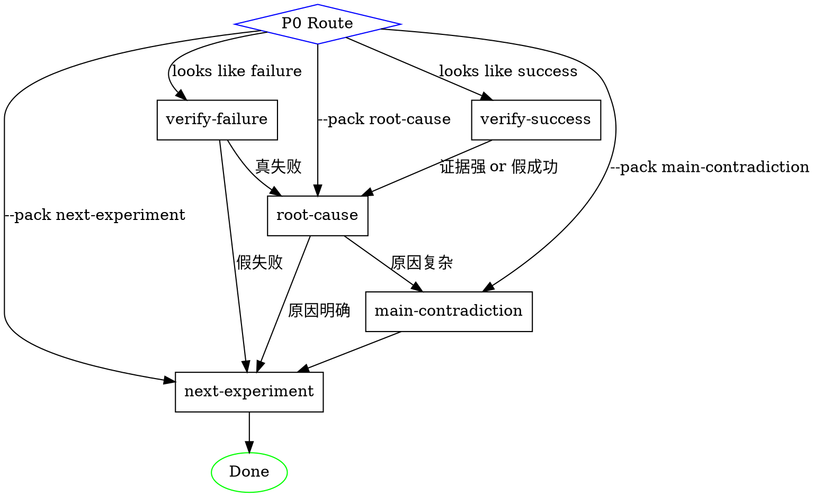

# Thinking Packs Implementation Plan

> **For Claude:** REQUIRED SUB-SKILL: Use superpowers:executing-plans to implement this plan task-by-task.

**Goal:** Create a `/think` skill that implements the 实践闭环 (practice loop) thinking framework with 5 core thinking packs, and integrate it as an automatic analysis layer in the existing `/build` skill.

**Architecture:** Independent `/think` skill with 5 prompt-based thinking packs (verify-success, verify-failure, root-cause, main-contradiction, next-experiment). Each pack is a prompt file following a uniform interface format. Build skill gains a Phase 4.5 think hook that auto-dispatches packs after verification. State passes through `.agent-log/thinking/` files and JSON artifacts for cross-pack chaining.

**Tech Stack:** Claude Code skills (SKILL.md + prompts), file-based state, subagent dispatch

---

## Task 1: Create shared thinking frameworks reference

**Files:**
- Create: `shared/thinking-frameworks.md`

**Step 1: Create the shared thinking frameworks file**

This file contains condensed summaries of 6 thinking tools. It is referenced by thinking pack prompts, not executed independently.

```markdown
# Thinking Frameworks Reference

These frameworks are拆解后的 agent 可调用"操作件". Use them as lenses within thinking packs, not as standalone procedures.

## 1. 实践论式闭环

实践 → 认识 → 再实践 → 再认识

Agent 应用：
- 每次行动后必须回到证据，不要停在语言自洽里
- 判断的标准是实践结果，不是逻辑美感
- "认识"如果不能指导下一轮"实践"，就还不是好的认识

## 2. 矛盾论式定位

多个问题中找主要矛盾 → 找矛盾的主要方面 → 判断矛盾的阶段转化

Agent 应用：
- 列出所有问题后，问：哪个问题一旦解决，会带动最多其他问题解决？
- 不要选最大最显眼的问题，选最可撬动的杠杆点
- 检查：当前阶段的突破口是否跟上一阶段一样？如果一样，可能已经过时

## 3. 科学方法

想法 → 可检验假设 → 实验 → 证据 → 校正判断

Agent 应用：
- 每个"我觉得"都要改写成"如果X，那么Y"
- 一次只变一个变量
- 提前定义：什么结果算假设成立，什么结果算假设不成立

## 4. Popper 证伪

主动寻找能推翻自己判断的证据

Agent 应用：
- 得出"成功了"的结论后，问：什么证据能说明这其实没有成功？
- 得出"原因找到了"的结论后，问：有没有相同原因但不同结果的案例？
- 如果一个结论找不到能推翻它的方法，说明这个结论太模糊，需要更精确

## 5. Lean Startup

构建 → 测量 → 学习，用最小实验获取最大信息

Agent 应用：
- 不做完美方案，做最小可验证方案
- 测量要测真正重要的，不要测容易测的
- 学习的速度 > 完美的程度

## 6. Toyota A3 / 5 Whys

问题 → 现状 → 根因 → 对策 → 验证，通过连续追问找到可行动的根因

Agent 应用：
- "为什么"至少追问到可行动或可验证的层面
- 区分根因、近因、背景条件、触发因素
- 根因如果不能生成下一轮行动，就还不是够好的根因
```

**Step 2: Commit**

```bash
git add shared/thinking-frameworks.md
git commit -m "feat: add shared thinking frameworks reference for thinking packs"
```

---

## Task 2: Create the 5 core thinking pack prompts

**Files:**
- Create: `skills/think/prompts/verify-success.md`
- Create: `skills/think/prompts/verify-failure.md`
- Create: `skills/think/prompts/root-cause.md`
- Create: `skills/think/prompts/main-contradiction.md`
- Create: `skills/think/prompts/next-experiment.md`

**Step 1: Create verify-success.md (真成了吗包)**

```markdown
---
name: verify-success
title: 真成了吗包
badge: 成功校验
trigger: 验证通过 / 行动看起来成功了
downstream:
  - condition: "证据强"
    next: root-cause
  - condition: "证据弱"
    next: "复现实验或缩小范围"
  - condition: "假成功"
    next: root-cause
---

# 真成了吗包

防止把偶然、噪声、局部改善误认为真正成功。

## 输入材料

- 目标：原始目标是什么
- 假设：出发时的假设是什么
- 行动/实验：做了什么
- 观察到的成功结果：看到了什么好的信号
- 成功标准：实验前定义的成功标准是什么
- 可用证据：能支持或反驳成功判断的证据
- 上下文：时间窗口、环境条件、对照组信息

## 核心问题

1. 这个结果是否满足实验前的成功标准？（注意：事后改标准不算）
2. 事实、解释、愿望、噪声分别是什么？
3. 是否存在偶然性、样本偏差、选择性观察、短期收益掩盖长期问题？
4. 什么证据能说明这其实没有成功？（Popper 证伪）

## 操作步骤

1. 还原实验前的成功标准，检查是否事后改口径
2. 把结果拆成事实、解释和期望，先只保留事实
3. 检查样本量、对照组、时间窗口、幸存者偏差和选择性观察
4. 寻找至少一个能推翻成功判断的反证
5. 给出证据等级：强、中、弱，并说明为什么
6. 决定是否可以放大，或必须先复现

参考框架：Popper 证伪 — 主动寻找能推翻判断的证据。

## 输出物

### Markdown 报告

写入 `{state_dir}/verify-success.md`：

```markdown
# 真成了吗 — 分析报告

## 结论
[真成功 / 假成功 / 不确定]

## 证据等级
[强 / 中 / 弱] — [说明原因]

## 事实 vs 解释 vs 愿望
[分别列出]

## 潜在偏差检查
- 偶然性：
- 样本偏差：
- 选择性观察：
- 短期 vs 长期：

## 最强反证
[什么证据能说明这其实没有成功？]

## 建议
[复现 / 放大 / 缩小范围 / 重新定义标准]
```

### JSON 结构化数据

写入 `{state_dir}/verify-success.json`：

```json
{
  "pack": "verify-success",
  "timestamp": "<ISO 8601>",
  "conclusion": "真成功 | 假成功 | 不确定",
  "evidence_level": "强 | 中 | 弱",
  "key_reasons": ["..."],
  "facts": ["..."],
  "interpretations": ["..."],
  "biases_found": ["..."],
  "strongest_counter_evidence": "...",
  "risks": ["..."],
  "next_action": "...",
  "downstream_pack": "root-cause | 复现实验"
}
```

## 下游接口

- 真成功 + 证据强 → root-cause（找到可复制成因）
- 真成功 + 证据弱 → 复现实验（先确认可复现再放大）
- 假成功 → root-cause（找到真正成因）
- 不确定 → 补充证据（缩小实验范围或增加样本）
```

**Step 2: Create verify-failure.md (真没成吗包)**

```markdown
---
name: verify-failure
title: 真没成吗包
badge: 失败校验
trigger: 验证失败 / 行动看起来失败了
downstream:
  - condition: "真失败"
    next: root-cause
  - condition: "假失败"
    next: next-experiment
  - condition: "不确定"
    next: "补全证据"
---

# 真没成吗包

防止把错误指标、过早判断、局部失败误认为整体失败。

## 输入材料

- 目标：原始目标是什么
- 假设：出发时的假设是什么
- 行动/实验：做了什么
- 观察到的失败表现：看到了什么不好的信号
- 失败标准：实验前定义的失败标准是什么
- 时间窗口：实验运行了多久
- 可用证据：能支持或反驳失败判断的证据
- 外部条件：环境变化、依赖方变化等

## 核心问题

1. 失败标准是否清楚？是否与原目标一致？
2. 判断是否过早？（时间窗口够不够，滞后效应有没有出现）
3. 有没有局部成功？（某个场景、人群、步骤或指标出现有效信号）
4. 是否测错了指标？（测了容易测的，而不是真正重要的）
5. 失败类型是什么？假设失败 / 执行失败 / 测量失败 / 环境失败

## 操作步骤

1. 确认失败标准是否清楚，是否与原目标一致
2. 检查判断是否过早：时间窗口够不够，滞后效应有没有出现
3. 寻找局部成功：哪一部分有效，哪一类人或场景有效
4. 检查指标是否选错：是否测了容易测的，而不是真正重要的
5. 区分执行失败、假设失败、环境失败和测量失败
6. 决定是停止、保留局部、换指标，还是继续补充实验

## 输出物

### Markdown 报告

写入 `{state_dir}/verify-failure.md`：

```markdown
# 真没成吗 — 分析报告

## 结论
[真失败 / 假失败 / 不确定]

## 失败分类
[假设失败 / 执行失败 / 测量失败 / 环境失败] — [说明原因]

## 局部成功信号
[哪些部分、场景或指标出现了有效信号]

## 指标检查
[当前指标是否反映了真正重要的东西]

## 时间窗口评估
[判断是否过早，是否存在滞后效应]

## 保留价值
[仍然值得保留的经验]

## 建议
[停止 / 调整 / 复测 / 转向]
```

### JSON 结构化数据

写入 `{state_dir}/verify-failure.json`：

```json
{
  "pack": "verify-failure",
  "timestamp": "<ISO 8601>",
  "conclusion": "真失败 | 假失败 | 不确定",
  "failure_type": "假设失败 | 执行失败 | 测量失败 | 环境失败",
  "partial_successes": ["..."],
  "metric_issues": ["..."],
  "timing_concerns": "...",
  "preserved_value": ["..."],
  "risks": ["..."],
  "next_action": "...",
  "downstream_pack": "root-cause | next-experiment | 补全证据"
}
```

## 下游接口

- 真失败 → root-cause（区分失败类型，找到根因）
- 假失败 → next-experiment（保留有效信号，重设指标或时间窗口）
- 不确定 → 补全证据（增加观察时间或换指标）
```

**Step 3: Create root-cause.md (根因分析包)**

```markdown
---
name: root-cause
title: 根因分析包
badge: 归因分析
trigger: 已确认成功或失败，需要解释原因
downstream:
  - condition: "原因复杂，多个系统条件交织"
    next: main-contradiction
  - condition: "原因明确，单一或少数根因"
    next: next-experiment
---

# 根因分析包

把"为什么"从情绪化解释，推进到可验证的因果链。

## 输入材料

- 要解释的结果：成功或失败的具体表现
- 过程记录：做了什么，按什么顺序
- 已知变量：关键的可控和不可控变量
- 对照案例：类似场景的不同结果（如果有）
- 异常现象：过程中的反常信号
- 上游分析：verify-success 或 verify-failure 的结论

## 核心问题

1. 所有可能的原因是什么？（不少于 5 个）
2. 每个原因追到哪一层了？（5 Whys 深挖）
3. 根因、近因、背景条件、触发因素分别是什么？
4. 有没有反例？（相同原因但不同结果，或不同原因但相同结果）
5. 哪些原因是可以改变并产生下一轮可验证行动的？

## 操作步骤

1. 列出所有候选原因，不急着选一个喜欢的解释
2. 用 5 Whys 深挖每个候选原因的上游条件
3. 按"可控性、影响力、证据强度"给原因排序
4. 寻找反例：相同原因是否也导致过不同结果
5. 区分根因、近因、背景条件和触发因素
6. 把最可能根因改写成可验证假设

参考框架：Toyota A3 / 5 Whys — 连续追问到可行动层面。

## 输出物

### Markdown 报告

写入 `{state_dir}/root-cause.md`：

```markdown
# 根因分析 — 分析报告

## 候选原因排序
[按影响力×可控性×证据强度排序]

## 5 Whys 分析
[对每个主要原因的追问链]

## 原因分类
- 根因：
- 近因：
- 背景条件：
- 触发因素：

## 反例检查
[相同原因但不同结果的案例，或不同原因但相同结果的案例]

## 最可能的 1-3 个根因
[带证据等级和评分]

## 可验证假设
[将根因改写为可检验假设]
```

### JSON 结构化数据

写入 `{state_dir}/root-cause.json`：

```json
{
  "pack": "root-cause",
  "timestamp": "<ISO 8601>",
  "candidate_causes": [
    {"cause": "...", "impact": "高|中|低", "controllability": "高|中|低", "evidence": "强|中|弱"}
  ],
  "root_causes": ["..."],
  "proximate_causes": ["..."],
  "background_conditions": ["..."],
  "triggers": ["..."],
  "counter_examples": ["..."],
  "testable_hypotheses": ["..."],
  "risks": ["..."],
  "next_action": "...",
  "downstream_pack": "main-contradiction | next-experiment"
}
```

## 下游接口

- 原因复杂（3+ 系统条件交织） → main-contradiction（找主要矛盾）
- 原因明确（单一或少数根因） → next-experiment（设计针对性实验）
```

**Step 4: Create main-contradiction.md (主要矛盾包)**

```markdown
---
name: main-contradiction
title: 主要矛盾包
badge: 突破口选择
trigger: 原因很多、约束很多，不知道先解决哪个
downstream:
  - condition: "找到突破口"
    next: next-experiment
---

# 主要矛盾包

从一堆问题里找当前阶段最值得抓的突破口。

## 输入材料

- 当前目标：我们最终要达到什么
- 当前阶段：在整体进程中的位置
- 已知问题/矛盾：所有已识别的问题和约束
- 可用资源：时间、人力、技术、资金
- 关键约束：不能改变的硬性限制
- 时间压力：紧迫程度
- 上游分析：root-cause 的候选原因排序

## 核心问题

1. 哪个矛盾一旦改变，会带动最多其他问题变化？
2. 当前阶段的主要方面是什么？（供给不足 / 需求不清 / 能力不够 / 信任不足）
3. 这个矛盾在什么条件下会转化？
4. 最可撬动的关键点在哪里？（不是最大最难最显眼的，是最能四两拨千斤的）

## 操作步骤

1. 列出所有阻碍目标实现的矛盾：需求、资源、能力、时间、组织、环境
2. 判断哪个矛盾一旦改变，会带动最多其他问题变化
3. 判断当前阶段的主要方面：是供给不足、需求不清、能力不够，还是信任不足
4. 检查矛盾是否会随阶段转化，避免拿旧突破口解决新问题
5. 选择一个可撬动的关键点，而不是选择最大、最难、最显眼的问题
6. 把突破策略写成一个具体实验

参考框架：矛盾论 — 找主要矛盾和矛盾的主要方面，注意阶段转化。

## 输出物

### Markdown 报告

写入 `{state_dir}/main-contradiction.md`：

```markdown
# 主要矛盾 — 分析报告

## 矛盾全景
[所有矛盾的列表和影响范围]

## 影响力分析
[每个矛盾影响哪些其他问题]

## 可撬动性分析
[哪个矛盾用较小行动能产生明显变化]

## 主要矛盾判定
[当前阶段的主要矛盾]

## 矛盾的主要方面
[哪一边正在主导局面]

## 阶段转化预警
[这个主要矛盾在什么条件下会转化]

## 突破策略
[具体、可执行的突破方案]
```

### JSON 结构化数据

写入 `{state_dir}/main-contradiction.json`：

```json
{
  "pack": "main-contradiction",
  "timestamp": "<ISO 8601>",
  "all_contradictions": [
    {"contradiction": "...", "impact_scope": ["..."], "leverage": "高|中|低"}
  ],
  "main_contradiction": "...",
  "main_aspect": "...",
  "transformation_conditions": ["..."],
  "breakthrough_strategy": "...",
  "risks": ["..."],
  "next_action": "...",
  "downstream_pack": "next-experiment"
}
```

## 下游接口

- 找到突破口 → next-experiment（把突破策略转化为实验）
```

**Step 5: Create next-experiment.md (下一轮实验包)**

```markdown
---
name: next-experiment
title: 下一轮实验包
badge: 行动生成
trigger: 已有判断、根因或突破口，需要继续实践
downstream:
  - condition: "实验设计完成"
    next: "执行后回到 verify-success 或 verify-failure"
---

# 下一轮实验包

把反思收束成更小、更准、更可验证的行动。

## 输入材料

- 上一轮结论：前面思维包的结论
- 待验证假设：需要检验的具体假设
- 主要矛盾/根因：当前最需要解决的问题
- 可用资源：时间、人力、技术限制
- 约束条件：不能改变的硬性限制
- 风险：已知的可能负面后果
- 上游分析：前面思维包的 JSON 输出

## 核心问题

1. 用一句话，本轮假设是什么？
2. 最小行动是什么？（尽量只改变一个关键变量）
3. 什么结果算成功？什么结果算失败？什么结果算信息不够？
4. 观察什么指标？结果指标、过程指标、反作用指标分别是什么？
5. 什么时候停止？（防止沉没成本）
6. 复盘时优先调用哪个思维包？

## 操作步骤

1. 把上一轮结论改写成一个可检验假设
2. 设计最小行动，只改变一个关键变量
3. 定义成功标准、失败标准和不确定标准
4. 提前写下停止条件，防止沉没成本
5. 设定观察指标：结果指标、过程指标、反作用指标
6. 安排复盘节点，明确下一次调用哪个思维包

参考框架：科学方法（可检验假设）+ Lean Startup（最小实验）。

## 输出物

### Markdown 报告

写入 `{state_dir}/next-experiment.md`：

```markdown
# 下一轮实验 — 设计报告

## 本轮假设
[一句话]

## 最小行动
[只改变一个关键变量的最小可执行方案]

## 成功/失败/不确定标准
- 成功：[什么结果算成]
- 失败：[什么结果算没成]
- 不确定：[什么情况说明信息不够]

## 观察指标
- 结果指标：
- 过程指标：
- 反作用指标：

## 停止条件
[什么情况下应该放弃这个方向]

## 复盘安排
[什么时候复盘，复盘时优先调用哪个思维包]
```

### JSON 结构化数据

写入 `{state_dir}/next-experiment.json`：

```json
{
  "pack": "next-experiment",
  "timestamp": "<ISO 8601>",
  "hypothesis": "...",
  "minimal_action": "...",
  "changed_variable": "...",
  "success_criteria": "...",
  "failure_criteria": "...",
  "uncertain_criteria": "...",
  "result_metrics": ["..."],
  "process_metrics": ["..."],
  "side_effect_metrics": ["..."],
  "stop_conditions": ["..."],
  "review_schedule": "...",
  "review_pack": "verify-success | verify-failure",
  "risks": ["..."],
  "next_action": "执行实验",
  "downstream_pack": "verify-success | verify-failure"
}
```

## 下游接口

- 实验执行后 → verify-success 或 verify-failure（根据实验结果选择入口）
```

**Step 6: Commit all 5 prompts**

```bash
git add skills/think/prompts/
git commit -m "feat: add 5 core thinking pack prompts (verify-success, verify-failure, root-cause, main-contradiction, next-experiment)"
```

---

## Task 3: Create the /think SKILL.md

**Files:**
- Create: `skills/think/SKILL.md`

**Step 1: Write SKILL.md**

The SKILL.md follows the build skill's pattern: YAML frontmatter, invocation, architecture, phases. The think skill has 3 phases instead of build's 7.

```markdown
---
name: think
description: Use when reflecting on results, analyzing success or failure, finding root causes, prioritizing problems, or planning next experiments. Triggers on "think", "reflect", "analyze", "root cause", "why did it fail", "why did it work", "what went wrong", "what should we do next", or any task requiring structured analysis of outcomes.
---

# /think

Structured analysis: judge → attribute → prioritize → design next action. File-based state, pack-chaining via JSON, full logging.

## Invocation

```
/think "<context>" [--pack <name>] [--from-build]
```

- `<context>`: What to analyze. May include goals, results, observations.
- `--pack <name>`: Skip auto-routing, directly invoke a specific pack. Options: `verify-success`, `verify-failure`, `root-cause`, `main-contradiction`, `next-experiment`.
- `--from-build`: Indicates this was auto-triggered by the build skill. Read state from the build session directory.

## Architecture

All state in files under `.agent-log/<timestamp>-think/`:

```
session.md                  # Master log: context, pack chain, decisions
verify-success.md           # Pack 1 output (markdown)
verify-success.json        # Pack 1 output (structured)
verify-failure.md          # Pack 2 output (markdown)
verify-failure.json        # Pack 2 output (structured)
root-cause.md              # Pack 3 output (markdown)
root-cause.json            # Pack 3 output (structured)
main-contradiction.md      # Pack 4 output (markdown)
main-contradiction.json    # Pack 4 output (structured)
next-experiment.md         # Pack 5 output (markdown)
next-experiment.json       # Pack 5 output (structured)
```

Shared thinking frameworks reference: `shared/thinking-frameworks.md`

Pack chaining: each pack's JSON `downstream_pack` field determines which pack runs next. The chain continues until `downstream_pack` is "done" or a terminal state.

## Execution Flow



## Phase 0: Routing

1. Parse args. Create `.agent-log/<YYYY-MM-DD-HHMMSS>-think/`.
2. Init `session.md` with context from `<context>` arg.
3. If `--from-build`: read the build session's `session.md`, `verify-report.md`, `understanding.md`, and `plan.md` to populate context.
4. If `--pack` specified: skip auto-routing, go directly to that pack.
5. If no `--pack`: auto-determine entry point:
   - Read context. If user describes a success → route to `verify-success`.
   - If user describes a failure → route to `verify-failure`.
   - If user asks "why" → route to `root-cause`.
   - If user asks "what to focus on" → route to `main-contradiction`.
   - If user asks "what next" → route to `next-experiment`.
   - Ambiguous: ask user.
6. Log routing decision to `session.md`. Proceed to the selected pack.

## Phase 1: Pack Execution

For the selected pack (and each subsequent pack in the chain):

1. Dispatch subagent (`general-purpose`) with the corresponding prompt file: `skills/think/prompts/<pack-name>.md`.
2. Fill placeholders in the prompt:
   - `{state_dir}`: the thinking session directory
   - `{upstream_json}`: if a previous pack ran, read its JSON output file
   - `{frameworks}`: read `shared/thinking-frameworks.md` for relevant framework references
3. The subagent writes both the markdown report and JSON output to `{state_dir}/`.
4. Read the JSON output. If `downstream_pack` points to another pack, loop back to step 1 with that pack.
5. Append to `session.md`: "[<pack-name>] <timestamp> — conclusion: <conclusion>, evidence: <level>, downstream: <next>"
6. Continue until `downstream_pack` is terminal (done) or all 5 packs have been executed.

## Phase 2: Summary

1. Read all pack outputs from the session.
2. Generate a concise summary for the user:
   - What was analyzed
   - Key conclusions from each pack
   - Evidence strength
   - Recommended next action
   - State directory path for full details
3. If `--from-build`: append a recommendation back to the build session's `session.md` indicating what the build skill should do next (continue fixing, narrow scope, or proceed to knowledge extraction).

## Build Integration Protocol

When called with `--from-build`, the think skill reads from and writes to the build session:

**Input from build:**
- `{build_state_dir}/session.md` — goal, iteration history
- `{build_state_dir}/verify-report.md` — verification results (triggers verify-success or verify-failure)
- `{build_state_dir}/understanding.md` — original requirements
- `{build_state_dir}/plan.md` — what was planned

**Output to build (appended to `{build_state_dir}/session.md`):**
```
## Think Analysis <timestamp>
**Entry pack**: [which pack was triggered]
**Chain**: [pack1] → [pack2] → ... → [packN]
**Conclusion**: [final conclusion]
**Recommendation**: [continue fixing | narrow scope | proceed to Phase 6 | redesign]
```

## Common Mistakes

| Mistake | Fix |
|---|---|
| Starting with explanations before confirming facts | Always start with verify-success or verify-failure |
| Treating all failures the same | Classify: hypothesis / execution / measurement / environment |
| Picking the "biggest" problem | Pick the most leveraged problem (main-contradiction) |
| Designing large experiments | Design minimal experiments that change one variable |
| Skipping JSON output | JSON is how packs chain — without it, the loop breaks |
| Forgetting to log to session.md | Every pack dispatch must be logged |
```

**Step 2: Commit**

```bash
git add skills/think/SKILL.md
git commit -m "feat: add /think skill with routing, pack chaining, and build integration protocol"
```

---

## Task 4: Create the think-hook prompts for build integration

**Files:**
- Create: `skills/build/prompts/think-hook-verify.md`
- Create: `skills/build/prompts/think-hook-iterate.md`

**Step 1: Create think-hook-verify.md**

This prompt is dispatched by the build skill after Phase 4 (Verification). It determines which thinking pack to invoke and what to do with the result.

```markdown
# Think Hook: Post-Verification Analysis

You are the think-hook agent. Your job is to analyze the verification result using the thinking packs framework, then recommend what the build skill should do next.

## Input

- State directory: `{state_dir}`
- Verification result: read from `{state_dir}/verify-report.md`
- Verification methods used: {verification_methods}

## Context

Read these files for context:
- `{state_dir}/session.md` — build goal and history
- `{state_dir}/understanding.md` — original requirements
- `{state_dir}/plan.md` — what was planned

## Instructions

1. Read `verify-report.md` and determine: Did verification pass or fail?

2. **If PASS (all checks passed):**
   - You need to invoke the **verify-success** thinking pack.
   - Read the prompt from `skills/think/prompts/verify-success.md`.
   - Fill the input materials from the build state:
     - 目标 = the build goal from session.md
     - 假设 = the plan's assumptions
     - 行动/实验 = what was executed (from session.md iteration history)
     - 观察到的成功结果 = the verification pass details
     - 成功标准 = the verification criteria from verify-report.md
     - 可用证据 = the verification method outputs
   - Execute the analysis steps from the prompt mentally.
   - Write the output to `{state_dir}/think-verify-success.md` and `{state_dir}/think-verify-success.json` following the output format in the prompt.

3. **If FAIL (any checks failed):**
   - You need to invoke the **verify-failure** thinking pack.
   - Read the prompt from `skills/think/prompts/verify-failure.md`.
   - Fill the input materials from the build state:
     - 目标 = the build goal from session.md
     - 假设 = the plan's assumptions
     - 行动/实验 = what was executed
     - 观察到的失败表现 = the verification failure details from verify-report.md
     - 失败标准 = the verification criteria
     - 时间窗口 = time spent on this iteration
     - 可用证据 = the verification method outputs
   - Execute the analysis steps from the prompt mentally.
   - Write the output to `{state_dir}/think-verify-failure.md` and `{state_dir}/think-verify-failure.json` following the output format in the prompt.

4. **Based on the thinking pack result, write a recommendation to `{state_dir}/think-recommendation.md`:**

```markdown
# Think Recommendation

## Entry Pack
[verify-success or verify-failure]

## Conclusion
[The pack's conclusion]

## Evidence Level
[强/中/弱]

## Recommendation for Build Skill

Choose one:
- **continue-fixing**: Issues are real, proceed to Phase 5 Fix with focused scope from root-cause analysis
- **narrow-scope**: Evidence is weak or uncertain, go back to Phase 3 with a smaller scope
- **re-verify**: Metrics may be wrong, go back to Phase 4 with adjusted verification
- **proceed**: Success is genuine, proceed to Phase 6 Knowledge Extraction
- **deep-analysis**: Root cause is complex, run root-cause and main-contradiction packs before fixing

## Reasoning
[Why this recommendation]
```

5. Append a log entry to `{state_dir}/session.md`:

```
## Think Analysis <timestamp>
**Entry**: [verify-success or verify-failure]
**Conclusion**: [真成功/假成功/不确定 or 真失败/假失败/不确定]
**Evidence**: [强/中/弱]
**Recommendation**: [continue-fixing | narrow-scope | re-verify | proceed | deep-analysis]
```

## Rules

- This is Phase 4.5 — it sits between Phase 4 (Verify) and Phase 5 (Fix).
- Do NOT modify any existing files except session.md (append only).
- The recommendation determines what the build skill does next. Be precise.
- If evidence level is "弱" for either pass or fail, default to recommending re-verify or narrow-scope rather than proceeding.
```

**Step 2: Create think-hook-iterate.md**

This prompt runs after the Phase 5 fix loop converges (or stalls), before the outer iteration loop decides whether to continue.

```markdown
# Think Hook: Post-Fix Analysis

You are the think-hook agent. Your job is to evaluate the fix cycle results and recommend whether the build should iterate again or proceed.

## Input

- State directory: `{state_dir}`
- Current iteration: {iteration_number}

## Context

Read these files:
- `{state_dir}/session.md` — full build history
- `{state_dir}/think-verify-success.md` or `{state_dir}/think-verify-failure.md` — the Phase 4.5 analysis (if it exists)
- `{state_dir}/think-recommendation.md` — the previous recommendation (if it exists)

## Instructions

1. Assess the fix cycle:
   - How many fix rounds were needed?
   - Did issues decrease across rounds?
   - Is the current state stable or fragile?

2. If the previous think-recommendation was "deep-analysis" and root-cause was NOT yet run:
   - Invoke the **root-cause** thinking pack using `skills/think/prompts/root-cause.md`.
   - Write output to `{state_dir}/think-root-cause.md` and `{state_dir}/think-root-cause.json`.
   - If root-cause finds multiple system conditions, also invoke **main-contradiction** using `skills/think/prompts/main-contradiction.md`.
   - Write output to `{state_dir}/think-main-contradiction.md` and `{state_dir}/think-main-contradiction.json`.
   - Update the recommendation based on the deeper analysis.

3. Write a recommendation to `{state_dir}/think-iterate-recommendation.md`:

```markdown
# Iterate Recommendation

## Fix Cycle Assessment
[How the fix cycle went]

## Think Analysis Results
[If root-cause or main-contradiction were run, summarize]

## Recommendation for Build Skill

Choose one:
- **next-iteration**: Issues resolved but need a fresh build pass — proceed to next outer iteration
- **stop-iterate**: Issues resolved, proceed to Phase 6 Knowledge Extraction
- **pivot**: Fundamental issues found — go back to Phase 1 (re-understand) or Phase 2 (re-plan)
- **continue-fixing**: More fix rounds needed, specific issues remain

## Reasoning
[Why this recommendation]
```

4. Append to `{state_dir}/session.md`:

```
## Iterate Think Analysis <timestamp>
**Assessment**: [fix cycle summary]
**Recommendation**: [next-iteration | stop-iterate | pivot | continue-fixing]
```

## Rules

- Do NOT modify understanding.md or plan.md.
- If this is the last iteration (--iterations N reached), recommend "stop-iterate" unless critical issues remain.
- A "pivot" recommendation is serious — only use it when root-cause reveals that the original plan was fundamentally wrong.
```

**Step 3: Commit**

```bash
git add skills/build/prompts/think-hook-verify.md skills/build/prompts/think-hook-iterate.md
git commit -m "feat: add think-hook prompts for build integration (Phase 4.5 and post-fix)"
```

---

## Task 5: Integrate thinking hooks into build SKILL.md

**Files:**
- Modify: `skills/build/SKILL.md`

**Step 1: Add Phase 4.5 to build SKILL.md**

Insert a new phase between Phase 4 and Phase 5. In the Execution Flow digraph, add a P45 node. Add the full phase definition after the Phase 4 section (around line 116).

Insert after the Phase 4 section (after "Any FAIL/PARTIAL → Phase 5."): Phase 4.5: Think Analysis (Post-Verification)

Add to the digraph: P45[label="P4.5 Think"]; P4->P45; P45->P5[label="continue-fixing"]; P45->CL[label="proceed"]; P45->P4[label="re-verify"]; P45->P1[label="narrow-scope"]; P45->P5[label="deep-analysis"]

Content:

```markdown
## Phase 4.5: Think Analysis (Post-Verification)

Runs after every Phase 4 verification. Provides deep analysis of the verification result before deciding whether to fix or proceed.

1. Dispatch subagent (`general-purpose`) with `./prompts/think-hook-verify.md`: `{state_dir}`, `{verification_methods}`.
2. Read `{state_dir}/think-recommendation.md`.
3. Follow the recommendation:
   - `continue-fixing` → proceed to Phase 5 Fix. If the think analysis identified a specific root cause, include it in the fix context.
   - `narrow-scope` → go back to Phase 3 Execution with a reduced scope (the think analysis will specify what to focus on).
   - `re-verify` → go back to Phase 4 with adjusted verification methods.
   - `proceed` → skip Phase 5, go directly to the iteration loop (this iteration is done).
   - `deep-analysis` → the think-hook-verify agent has already started root-cause analysis. Read `{state_dir}/think-root-cause.md` if it exists, then proceed to Phase 5 Fix with focused scope.
```

Also update the "Phase 5: Iteration Fix" section to note that fix context may come from think analysis.

**Step 2: Add post-fix think hook before iteration loop decision**

In the "Iteration Loop" section, after the outer loop execution step 3 ("After iteration completes"), add a think analysis check:

After "If `current_iteration >= N`: stop. Proceed to Phase 6." add:

```markdown
   - Before proceeding to Phase 6 (or next iteration), dispatch think-hook-iterate:
     - Run `./prompts/think-hook-iterate.md`: `{state_dir}`, `{current_iteration}`.
     - Read `{state_dir}/think-iterate-recommendation.md`.
     - Follow the recommendation: `stop-iterate`, `next-iteration`, `pivot`, or `continue-fixing`.
```

**Step 3: Update the Architecture section**

In the Architecture section, add think analysis files to the state directory listing:

```markdown
think-verify-success.md   # Phase 4.5 verify-success analysis
think-verify-success.json
think-verify-failure.md   # Phase 4.5 verify-failure analysis
think-verify-failure.json
think-recommendation.md   # Phase 4.5 recommendation
think-root-cause.md       # Deep analysis (if triggered)
think-root-cause.json
think-main-contradiction.md
think-main-contradiction.json
think-iterate-recommendation.md  # Post-fix recommendation
```

**Step 4: Commit**

```bash
git add skills/build/SKILL.md
git commit -m "feat: integrate Phase 4.5 think hooks into build skill"
```

---

## Task 6: Update install.sh and verify installation

**Files:**
- No changes needed (install.sh already loops over all `skills/*/` directories)

**Step 1: Run install script**

```bash
./install.sh
```

Expected output: `think: symlink created` (or `symlink updated`)

**Step 2: Verify symlinks**

```bash
ls -la ~/.claude/skills/
```

Expected: both `build` and `think` symlinks pointing to the repo.

**Step 3: Verify file structure**

```bash
find skills/think/ -type f | sort
```

Expected:
```
skills/think/SKILL.md
skills/think/prompts/main-contradiction.md
skills/think/prompts/next-experiment.md
skills/think/prompts/root-cause.md
skills/think/prompts/verify-failure.md
skills/think/prompts/verify-success.md
```

**Step 4: Verify build integration files exist**

```bash
ls skills/build/prompts/think-hook-*.md
```

Expected:
```
skills/build/prompts/think-hook-iterate.md
skills/build/prompts/think-hook-verify.md
```

**Step 5: Commit if any changes were needed**

```bash
git status
# Only commit if install.sh needed changes
```

---

## Task 7: Smoke test — verify skill definitions are valid

**Step 1: Check SKILL.md frontmatter for both skills**

Verify both SKILL.md files have valid YAML frontmatter with `name` and `description` fields:

```bash
head -4 skills/think/SKILL.md
head -4 skills/build/SKILL.md
```

**Step 2: Verify all prompt files referenced in SKILL.md exist**

For think skill:
```bash
# Check all prompts exist
for f in verify-success verify-failure root-cause main-contradiction next-experiment; do
  test -f "skills/think/prompts/${f}.md" && echo "OK: ${f}.md" || echo "MISSING: ${f}.md"
done
```

For build integration:
```bash
test -f skills/build/prompts/think-hook-verify.md && echo "OK: think-hook-verify.md"
test -f skills/build/prompts/think-hook-iterate.md && echo "OK: think-hook-iterate.md"
```

**Step 3: Verify JSON schema fields are consistent across packs**

All 5 pack JSON outputs should have: `pack`, `timestamp`, `conclusion` (or `hypothesis` for next-experiment), `downstream_pack`.

```bash
grep -c "downstream_pack" skills/think/prompts/*.md
```

Expected: all 5 prompt files should reference `downstream_pack`.

**Step 4: Verify shared reference exists**

```bash
test -f shared/thinking-frameworks.md && echo "OK: shared/thinking-frameworks.md"
```

---

## Summary

| Task | What | Files |
|---|---|---|
| 1 | Shared thinking frameworks | `shared/thinking-frameworks.md` |
| 2 | 5 core thinking pack prompts | `skills/think/prompts/*.md` (5 files) |
| 3 | /think SKILL.md | `skills/think/SKILL.md` |
| 4 | Build integration prompts | `skills/build/prompts/think-hook-*.md` (2 files) |
| 5 | Build SKILL.md integration | `skills/build/SKILL.md` (modified) |
| 6 | Install and verify | `install.sh` (no changes expected) |
| 7 | Smoke test | Verification only |
