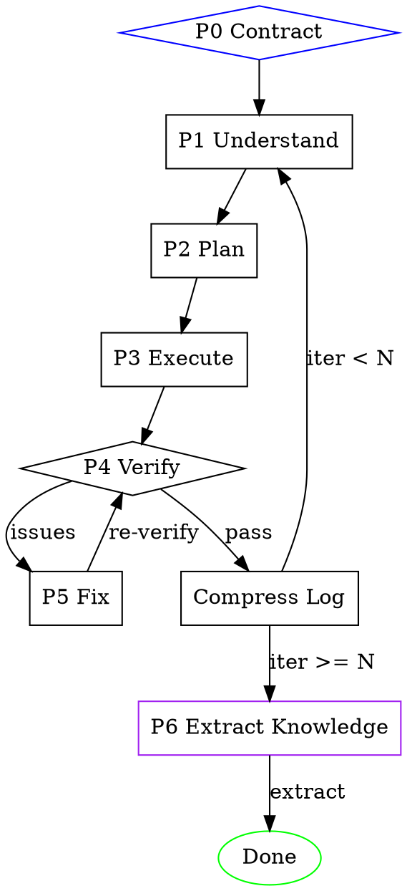

# /build

Self-driving loop: understand -> plan -> execute -> verify -> iterate. File-based state, subagent isolation, full logging. Human interacts only at Phase 0.

## Invocation

```
/build "<task>" [--iterations N] [--verification "method1,method2"]
```

- `<task>`: What to build. May include file paths, URLs, or references.
- `--iterations N`: Closed-loop cycles (default 1).
- `--verification`: Comma-separated: `design-comparison`, `automated-testing`, `visual-comparison`, `code-review`. Omit to auto-detect and ask human.

## Architecture

All state in files under `.agent-log/<timestamp>-build/`:

```
session.md           # Master log: head=goal, tail=progress
understanding.md     # Phase 1 output
plan.md              # Phase 2 output
verify-report.md     # Phase 4 output
iteration-N/         # Per-iteration details
```

Persistent cross-session knowledge at `$HOME/.claude/build-knowledge/`:

```
$HOME/.claude/build-knowledge/
  knowledge/
    understanding.md   # Learnings for the understand phase
    planning.md        # Learnings for the plan phase
    execution.md       # Learnings for the execute phase
    verification.md    # Learnings for the verify phase
```

New prompt templates: `prompts/extract-knowledge.md`, `prompts/compact-knowledge.md`.

Subagents isolated — state passes through `{state_dir}` files, never conversation.

## Execution Flow



## Phase 0: Contract Confirmation (Human Gate)

1. Parse args. Create `.agent-log/<YYYY-MM-DD-HHMMSS>-build/`.
2. Init `session.md` with Goal.
3. If `--verification` omitted: analyze project, ask human to select methods.
4. Detect `$HOME/.claude/build-knowledge/` knowledge store. Classify project type as `language/framework-archetype` (e.g., `python-cli`, `react-spa`, `go-api`, `skill-modification`). Write the classification to `session.md` as `## Project Type: [type]`.
5. Write Verification Plan to `session.md`. Proceed to Phase 1.

## Phase 1: Deep Understanding

Dispatch subagent (`general-purpose`) with `./prompts/understand.md` filled: `{state_dir}`, `{references}`, `{relevant_knowledge}`.

Fill `{relevant_knowledge}` (mapped to `knowledge/understanding.md`): read `$HOME/.claude/build-knowledge/knowledge/understanding.md`, filter by project type tag, include top entries (~1500 tokens max). If file missing, empty, or malformed, set to empty string and proceed without knowledge injection. After dispatch, log to `session.md`: "Applied N entries from M sessions in understand phase." (If zero, log "No prior knowledge available for understand phase.")

Verify `understanding.md` exists. Resolve "Open Questions" if possible; otherwise log warning and proceed.

## Phase 2: Planning

Dispatch subagent (`Plan`) with `./prompts/plan.md` filled: `{state_dir}`, `{planning_knowledge}`.

Fill `{planning_knowledge}`: read `$HOME/.claude/build-knowledge/knowledge/planning.md`, filter by project type tag, include top entries (~1500 tokens max). If file missing, empty, or malformed, set to empty string and proceed without knowledge injection. After dispatch, log to `session.md`: "Applied N entries from M sessions in plan phase." (If zero, log "No prior knowledge available for plan phase.")

Verify `plan.md`: steps ordered, each has verification criterion, dependencies consistent.

## Phase 3: Execution

For each step in `plan.md`:
1. Dispatch subagent (`general-purpose`) with `./prompts/execute-step.md`: `{state_dir}`, `{step_number}`, `{execution_knowledge}`.
2. Fill `{execution_knowledge}`: read `$HOME/.claude/build-knowledge/knowledge/execution.md`, filter by project type tag, include top entries (~1500 tokens max). If file missing, empty, or malformed, set to empty string and proceed without knowledge injection. After dispatch, log to `session.md`: "Applied N entries from M sessions in execute phase." (If zero, log "No prior knowledge available for execute phase.")
3. Fail -> retry once -> if still fails, log `**FAILED**` and continue.
4. Plans >8 steps: parallelize independent steps in one message.

## Phase 4: Verification

**Before dispatching:** If `verify-report.md` already exists, move it to `verify-report-prev.md` (do not lose history).

Dispatch subagent (`general-purpose`) with `./prompts/verify.md`: `{state_dir}`, `{verification_methods}`, `{verification_knowledge}`.

Fill `{verification_knowledge}`: read `$HOME/.claude/build-knowledge/knowledge/verification.md`, filter by project type tag, include top entries (~1500 tokens max). If file missing, empty, or malformed, set to empty string and proceed without knowledge injection. After dispatch, log to `session.md`: "Applied N entries from M sessions in verify phase." (If zero, log "No prior knowledge available for verify phase.")

Read `verify-report.md`: all PASS → this iteration complete. Any FAIL/PARTIAL → Phase 5.

## Phase 5: Iteration Fix

1. Increment `fix_round` counter (starts at 1, increments each time Phase 5 runs within the same iteration).
2. Create `iteration-N/fix-round-{fix_round}/`, copy current `verify-report.md` into it as `verify-report-before.md`.
3. Dispatch subagent (`general-purpose`) with `./prompts/fix.md`: `{state_dir}`, `{iteration_number}`.
4. Return to Phase 4 (re-verify).
5. If Phase 4 finds no new issues → this iteration is complete. Go to **Iteration Loop** below.
6. If Phase 4 still finds issues but fewer than before → continue fixing (stay in Phase 5).
7. If Phase 4 finds the same or more issues for 2 consecutive fix rounds → log warning, stop fixing within this iteration. Go to **Iteration Loop**.

## Iteration Loop

**CRITICAL: Understand the two loop levels.**

```
OUTER LOOP (--iterations N):
  iteration=1,2,...N
    Phase 1 → Phase 2 → Phase 3 → Phase 4 → Phase 5 (inner loop) → done

INNER LOOP (fix rounds within one iteration):
  Phase 4 → Phase 5 → Phase 4 → Phase 5 → ... until convergence
```

**`--iterations N` controls the OUTER loop only.** The inner loop (fix rounds) runs until convergence or the 2-round stall rule above.

### Outer loop execution:

1. Initialize `current_iteration = 1`.
2. Execute Phases 1-5 for `current_iteration`.
3. After iteration completes (Phase 5 convergence or stall):
   - If `current_iteration < N`:
     - Increment `current_iteration`.
     - If `session.md` >200 lines, dispatch compress-log subagent.
     - Start fresh Phase 1 (subagent reads compressed session.md for context).
   - If `current_iteration >= N`: stop. Proceed to Phase 6.

### Convergence detection (inner loop):

| Signal | Action |
|---|---|
| Zero new issues | Inner loop complete. Next outer iteration (if any). |
| Issues decreasing | Continue inner loop (another fix round). |
| Issues same 2 fix rounds | Warning, inner loop stall. Next outer iteration (if any). |

## Phase 6: Knowledge Extraction

Runs after the iteration loop completes (success or max iterations reached).

1. Dispatch subagent (`general-purpose`) with `./prompts/extract-knowledge.md` filled: `{state_dir}`, `{knowledge_dir}` = `$HOME/.claude/build-knowledge`.
2. After extraction, check if any knowledge file exceeds ~200 lines; if so, dispatch compaction subagent with `./prompts/compact-knowledge.md`: `{knowledge_dir}`.

## Context Management

| Phase | Subagent | Notes |
|---|---|---|
| Understand | `general-purpose` | Full context + knowledge injection |
| Plan | `Plan` | Reads understanding.md + knowledge injection |
| Execute | `general-purpose`/step | One step per call + knowledge injection |
| Verify | `general-purpose` | Reads all outputs + knowledge injection |
| Fix | `general-purpose` | Reads verify-report |
| Extract Knowledge | `general-purpose` | Post-loop, reads all session files |
| Compact Knowledge | `general-purpose` | Triggered when knowledge files >~200 lines |

**Log compaction:** >200 lines -> compress. Goal/Verification Plan unchanged; older content -> Progress Summary.

## Completion

Print: iterations, remaining issues, log path. Include count of learnings extracted and count of past learnings applied.

## Common Mistakes

| Mistake | Fix |
|---|---|
| State via conversation | Use `{state_dir}` files |
| Skipping Phase 1 | Prevents cascading errors |
| Not logging failures | Log with `**FAILED**` marker |
| Verify only once | Always re-verify after fixes |
| Context too long | Subagents + compress at >200 lines |
| Forgetting knowledge extraction | Always run Phase 6, even on failed sessions |
| Over-injecting knowledge | Cap knowledge injection at ~1500 tokens; filter by project type |
| Modifying prompt files directly | Knowledge goes to the store, never auto-modify prompts |
