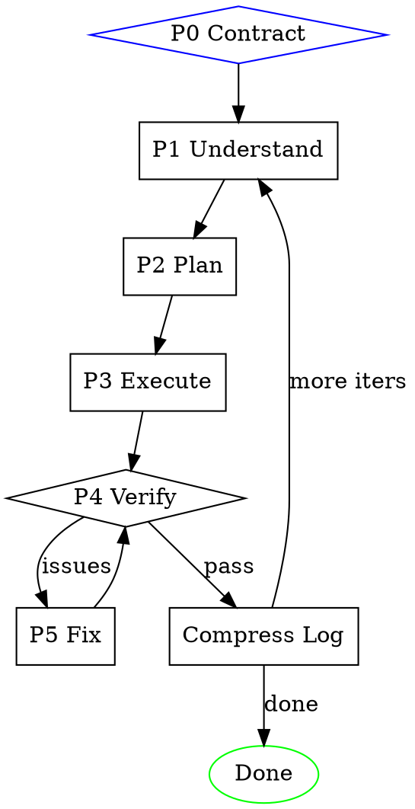

# /build

Self-driving loop: understand -> plan -> execute -> verify -> iterate. File-based state, subagent isolation, full logging. Human interacts only at Phase 0.

## Invocation

```
/build "<task>" [--iterations N] [--verification "method1,method2"]
```

- `<task>`: What to build. May include file paths, URLs, or references.
- `--iterations N`: Closed-loop cycles (default 1).
- `--verification`: Comma-separated: `design-comparison`, `automated-testing`, `visual-comparison`, `code-review`. Omit to auto-detect and ask human.

## Architecture

All state in files under `.agent-log/<timestamp>-build/`:

```
session.md           # Master log: head=goal, tail=progress
understanding.md     # Phase 1 output
plan.md              # Phase 2 output
verify-report.md     # Phase 4 output
iteration-N/         # Per-iteration details
```

Subagents isolated — state passes through `{state_dir}` files, never conversation.

## Execution Flow



## Phase 0: Contract Confirmation (Human Gate)

1. Parse args. Create `.agent-log/<YYYY-MM-DD-HHMMSS>-build/`.
2. Init `session.md` with Goal.
3. If `--verification` omitted: analyze project, ask human to select methods.
4. Write Verification Plan to `session.md`. Proceed to Phase 1.

## Phase 1: Deep Understanding

Dispatch subagent (`general-purpose`) with `./prompts/understand.md` filled: `{task_description}`, `{state_dir}`, `{references}`.

Verify `understanding.md` exists. Resolve "Open Questions" if possible; otherwise log warning and proceed.

## Phase 2: Planning

Dispatch subagent (`Plan`) with `./prompts/plan.md` filled: `{state_dir}`.

Verify `plan.md`: steps ordered, each has verification criterion, dependencies consistent.

## Phase 3: Execution

For each step in `plan.md`:
1. Dispatch subagent (`general-purpose`) with `./prompts/execute-step.md`: `{state_dir}`, `{step_number}`.
2. Fail -> retry once -> if still fails, log `**FAILED**` and continue.
3. Plans >8 steps: parallelize independent steps in one message.

## Phase 4: Verification

Dispatch subagent (`general-purpose`) with `./prompts/verify.md`: `{state_dir}`, `{verification_methods}`.

Read `verify-report.md`: all PASS -> Done. Any FAIL/PARTIAL -> Phase 5.

## Phase 5: Iteration Fix

1. Create `iteration-N/`, copy `verify-report.md` into it.
2. Dispatch subagent (`general-purpose`) with `./prompts/fix.md`: `{state_dir}`, `{iteration_number}`.
3. Return to Phase 4.

## Iteration Loop

| Signal | Action |
|---|---|
| Zero new issues | Success |
| Issues decreasing | Continue |
| Issues same 2 iters | Warning, continue |
| Max iterations | Stop, report remaining |

Multi-iteration: if `session.md` >200 lines, compress log. Start fresh Phase 1 for next iteration.

## Context Management

| Phase | Subagent | Notes |
|---|---|---|
| Understand | `general-purpose` | Full context |
| Plan | `Plan` | Reads understanding.md |
| Execute | `general-purpose`/step | One step per call |
| Verify | `general-purpose` | Reads all outputs |
| Fix | `general-purpose` | Reads verify-report |

**Log compaction:** >200 lines -> compress. Goal/Verification Plan unchanged; older content -> Progress Summary.

## Completion

Print: iterations, remaining issues, log path.

## Common Mistakes

| Mistake | Fix |
|---|---|
| State via conversation | Use `{state_dir}` files |
| Skipping Phase 1 | Prevents cascading errors |
| Not logging failures | Log with `**FAILED**` marker |
| Verify only once | Always re-verify after fixes |
| Context too long | Subagents + compress at >200 lines |
