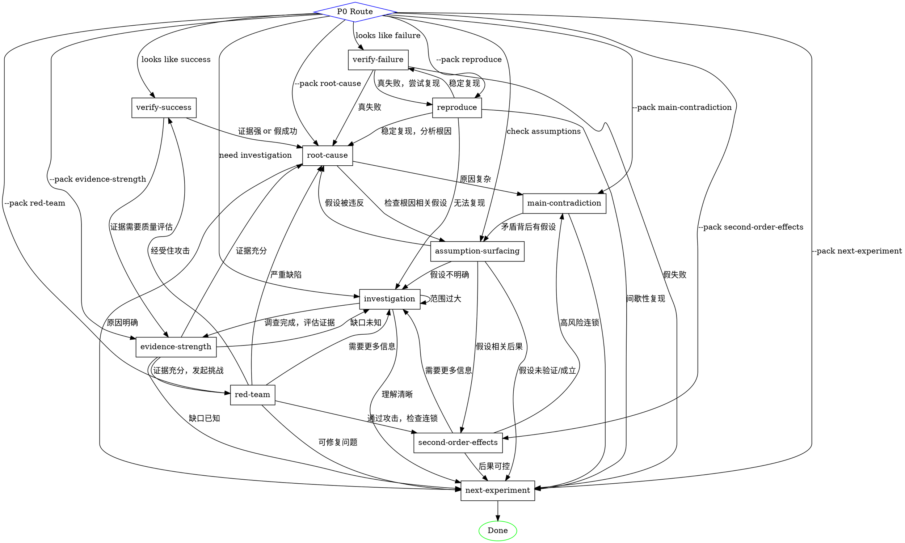

# /think

Structured analysis: investigate → judge → attribute → prioritize → design next action. File-based state, pack-chaining via JSON, full logging.

## Invocation

```
/think "<context>" [--pack <name>] [--from-build]
```

- `<context>`: What to analyze. May include goals, results, observations.
- `--pack <name>`: Skip auto-routing, directly invoke a specific pack. Options: `verify-success`, `verify-failure`, `root-cause`, `main-contradiction`, `next-experiment`, `reproduce`, `red-team`, `second-order-effects`, `investigation`, `evidence-strength`, `assumption-surfacing`.
- `--from-build`: Indicates this was auto-triggered by the build skill. Read state from the build session directory.

## Architecture

All state in files under `.agent-log/<timestamp>-think/`:

```
session.md                  # Master log: context, pack chain, decisions
verify-success.md           # Pack 1 output (markdown)
verify-success.json         # Pack 1 output (structured)
verify-failure.md           # Pack 2 output (markdown)
verify-failure.json         # Pack 2 output (structured)
root-cause.md               # Pack 3 output (markdown)
root-cause.json             # Pack 3 output (structured)
main-contradiction.md       # Pack 4 output (markdown)
main-contradiction.json     # Pack 4 output (structured)
next-experiment.md          # Pack 5 output (markdown)
next-experiment.json        # Pack 5 output (structured)
reproduce.md                # Pack 6 output (markdown)
reproduce.json              # Pack 6 output (structured)
red-team.md                 # Pack 7 output (markdown)
red-team.json               # Pack 7 output (structured)
second-order-effects.md     # Pack 8 output (markdown)
second-order-effects.json   # Pack 8 output (structured)
investigation.md            # Pack 9 output (markdown)
investigation.json          # Pack 9 output (structured)
evidence-strength.md        # Pack 10 output (markdown)
evidence-strength.json      # Pack 10 output (structured)
assumption-surfacing.md     # Pack 11 output (markdown)
assumption-surfacing.json   # Pack 11 output (structured)
```

Shared thinking frameworks reference: `shared/thinking-frameworks.md`

Pack chaining: each pack's JSON `downstream_pack` field determines which pack runs next. The chain continues until `downstream_pack` is "done" or a terminal state. Chain depth limit: 10 packs.

## Execution Flow



## Phase 0: Routing

1. Parse args. Create `.agent-log/<YYYY-MM-DD-HHMMSS>-think/`.
2. Init `session.md` with context from `<context>` arg.
3. If `--from-build`: read the build session's `session.md`, `verify-report.md`, `understanding.md`, and `plan.md` to populate context.
4. If `--pack` specified: skip auto-routing, go directly to that pack.
5. If no `--pack`: auto-determine entry point:
   - If user describes a success → route to `verify-success`.
   - If user describes a failure → route to `verify-failure`.
   - If user asks "why" → route to `root-cause`.
   - If user asks "what to focus on" → route to `main-contradiction`.
   - If user asks "what next" → route to `next-experiment`.
   - If user asks "can we reproduce", "能重现吗", "reproduce" → route to `reproduce`.
   - If user asks "attack this", "what's wrong", "red team", "有什么风险", "有什么漏洞" → route to `red-team`.
   - If user asks "what are the consequences", "连锁影响", "side effects" → route to `second-order-effects`.
   - If user says "我不理解", "need to investigate", "不了解", "不熟悉" → route to `investigation`.
   - If user asks "evidence quality", "证据够不够", "confidence" → route to `evidence-strength`.
   - If user asks "assumptions", "盲点", "what am I taking for granted" → route to `assumption-surfacing`.
   - Ambiguous: ask user.
6. Log routing decision to `session.md`. Proceed to the selected pack.

## Phase 1: Pack Execution

For the selected pack (and each subsequent pack in the chain):

1. Dispatch subagent (`general-purpose`) with the corresponding prompt file: `skills/think/prompts/<pack-name>.md`.
2. Fill placeholders in the prompt:
   - `{state_dir}`: the thinking session directory
   - `{upstream_json}`: if a previous pack ran, read its JSON output file
   - `{frameworks}`: read `shared/thinking-frameworks.md` for relevant framework references
3. The subagent writes both the markdown report and JSON output to `{state_dir}/`.
4. Read the JSON output. If `downstream_pack` points to another pack, loop back to step 1 with that pack.
5. Append to `session.md`: "[<pack-name>] <timestamp> — conclusion: <conclusion>, evidence: <level>, downstream: <next>"
6. Continue until `downstream_pack` is terminal (done) or 10 packs have been executed.

## Common Chaining Patterns

1. **Pre-flight pattern**: assumption-surfacing → investigation → evidence-strength → next-experiment
   (Before starting: surface assumptions, investigate unknowns, confirm evidence quality, design first action)

2. **Debug pattern**: reproduce → verify-failure → root-cause → assumption-surfacing → next-experiment
   (When debugging: reproduce the issue, confirm it's real, find root cause, check assumptions, design fix)

3. **Robust verification pattern**: verify-success → evidence-strength → red-team → second-order-effects → next-experiment
   (When confirming success: verify, check evidence quality, adversarial test, check consequences, design next step)

4. **Deep failure pattern**: verify-failure → reproduce → root-cause → main-contradiction → assumption-surfacing → second-order-effects → next-experiment
   (When things go wrong: confirm failure, reproduce, find cause, prioritize, check assumptions, check consequences, design fix)

## Phase 2: Summary

1. Read all pack outputs from the session.
2. Generate a concise summary for the user:
   - What was analyzed
   - Key conclusions from each pack
   - Evidence strength
   - Recommended next action
   - State directory path for full details
3. If `--from-build`: append a recommendation back to the build session's `session.md` indicating what the build skill should do next (continue fixing, narrow scope, or proceed to knowledge extraction).

## Build Integration Protocol

When called with `--from-build`, the think skill reads from and writes to the build session:

**Input from build:**
- `{build_state_dir}/session.md` — goal, iteration history
- `{build_state_dir}/verify-report.md` — verification results (triggers verify-success or verify-failure)
- `{build_state_dir}/understanding.md` — original requirements
- `{build_state_dir}/plan.md` — what was planned

**Output to build (appended to `{build_state_dir}/session.md`):**
```
## Think Analysis <timestamp>
**Entry pack**: [which pack was triggered]
**Chain**: [pack1] → [pack2] → ... → [packN]
**Conclusion**: [final conclusion]
**Recommendation**: [continue fixing | narrow scope | proceed to Phase 6 | redesign]
```

## Common Mistakes

| Mistake | Fix |
|---|---|
| Starting with explanations before confirming facts | Always start with verify-success or verify-failure |
| Treating all failures the same | Classify: hypothesis / execution / measurement / environment |
| Picking the "biggest" problem | Pick the most leveraged problem (main-contradiction) |
| Designing large experiments | Design minimal experiments that change one variable |
| Skipping JSON output | JSON is how packs chain — without it, the loop breaks |
| Forgetting to log to session.md | Every pack dispatch must be logged |
| Assuming evidence is sufficient without checking | Run evidence-strength before root-cause when evidence feels thin |
| Implementing without challenging the plan | Run red-team before committing to a design |
| Fixing without checking side effects | Run second-order-effects after root-cause |
| Starting work without checking assumptions | Run assumption-surfacing at the start of unfamiliar tasks |
| Debugging without reproducing first | Run reproduce before verify-failure to confirm the issue is real |
| Starting work without investigating first | Run investigation when facing unfamiliar code, APIs, or unclear requirements |
